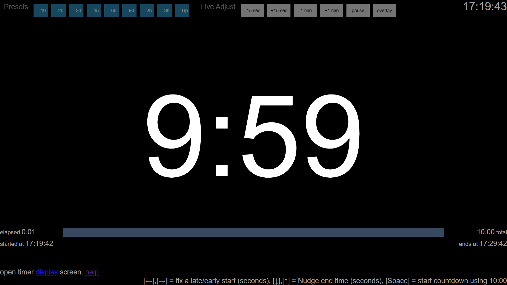
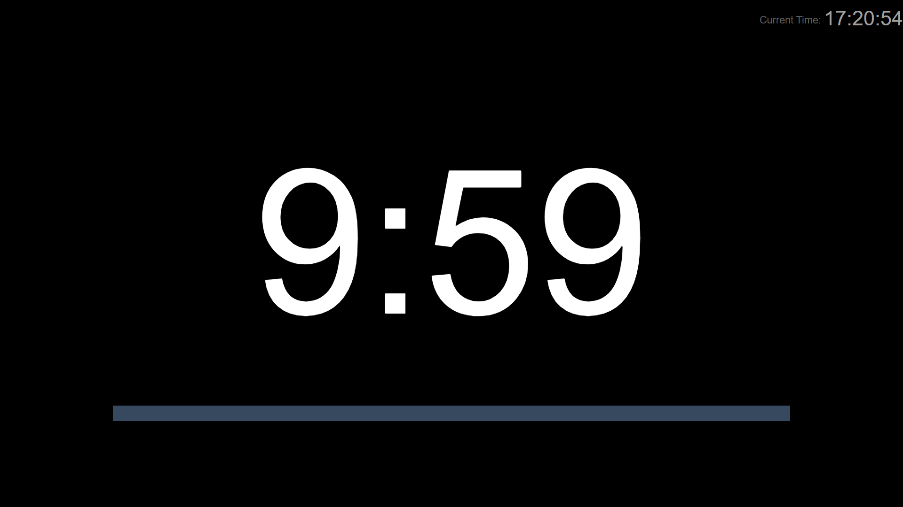
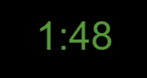
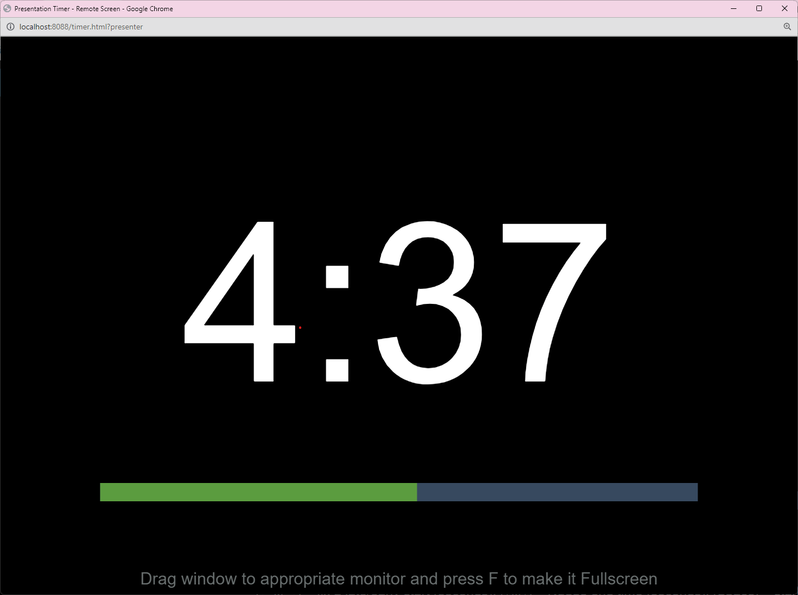

## sophtwhere-timer

This connection enables a countdown timer on your computer, which you display using a web browser.

**You don't need to install any additional software, the timer runs locally in your browser, and is automatically enabled when your add this connection**

**TLDR** *Click a link below to open the timer page, once you are familiar with these instructions.*

<!--other links-->

Keys used in the browser
---
<kbd>P</kbd> Turns the controller window into a presenter's window.   
  - *the presenter's window is a cleaner display, without extra distractions*
  - *pressing <kbd>P</kbd> again will restore the presenter's window to a controller window*
  - *everything still works the same in presenter's view mode, but without the visual feedback you get while editing durations and custom text - however a better solution is to use a remote window for the presenter*

<kbd>R</kbd> Toggle display of the remote window  
   - *the remote window is a secondary window that you can drag to a second monitor, automatically configured to display the timer in presenter's mode*
   - *this key only works from the controller view mode*
   - *pressing <kbd>R</kbd> again closes the remote window*
   - *the remote window will be closed when you close the controller window*

<kbd>F</kbd> Make the current window full screen.  
   - *pressing <kbd>F</kbd> again restores a window from fullscreen mode*
   - *on some systems there are other keys that will also enable full screen, it's fine to use whatever method you like, however, in most cases, you need to use the same method to enter and exit. The <kbd>F</kbd> key is implemented to enter full screen, regardless of what browser or operating system, you are using*

<kbd>O</kbd> Toggle the floating overlay window.  

<kbd>S</kbd> This is a shortcut to immediately make turn a controller window into a full screen presenter window ("single screen mode"). 
 - *it's not a toggle key, but pressing <kbd>F</kbd> WILL exit fullscreen, and pressing <kbd>P</kbd> will toggle between fullscreen presenter screen, and full screen controller mode, if that's your preference*

About the Timer's Display Modes 
===

Dual Display Mode
---

In this mode, you will use one browser as a controller display screen, with another browser window which you drag to a spare monitor, and to display a stage timer screen.

  * the controller screen has information which may be useful for an operator
  

  * the stage timer screen has a countdown timer, intended to be viewed by a presenter. 
  
  * there's an optional progress bar, the time of day, and custom messages entered by the operator.
  

Overlay Mode
---

In this mode, you will use a browser as a controller display screen, and a floating "always on top" window which displays the countdown.

  * the floating overlay window only shows the remaining time

  

Single Display Mode
---

In this mode, you will use a single browser window to display the timer, which will change it's output to look the same as the stage timer screen described above.

Activating Dual Display Mode
===

*First, close any timer browser windows that might be open.*

Click <a href="http://localhost:8088" target="_blank" rel="noopener">here </a> to open the timer controller screen, which you can reposition to the display you intend to use for the operator:

Next, while still in that browser window, press the [ R ] key on your keyboard. This will open the "Remote" window:

Drag the remote window to the display you wish to use for the stage display, and press the [ F ] key to make it full screen. *note - this is optional. if you don't want to make it full screen, that's up to you*

Returning to the Controller window/tab, if you wish to make that fullscreen also, you can do this with the [ F ] key also.

Activating Single Display Mode
===

*First, close any timer browser windows that might be open.*

Click <a href="http://localhost:8088" target="_blank" rel="noopener">here </a> to open the timer controller screen, which you can reposition to the display you intend to use as the stage display:

once you're happy the browser is on the display you wish to use, press the [ S ] key to activate it as a full screen stage display:

Activating Overlay Mode
===

First activate one of the other display modes, then press the [ O ] key to toggle the overlay window.
the overlay window is always available, but it can only be activated from the browser itself.

***The 3 various display modes described above can't be adjusted from companion, due to web browser fullscreen and video permission rules, however all other aspects of the timer can be configured using companion.***

Configuring Companion
===

