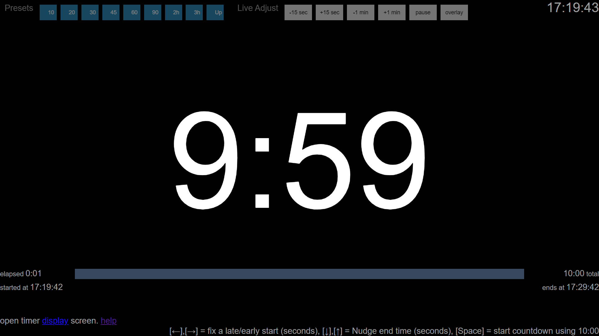
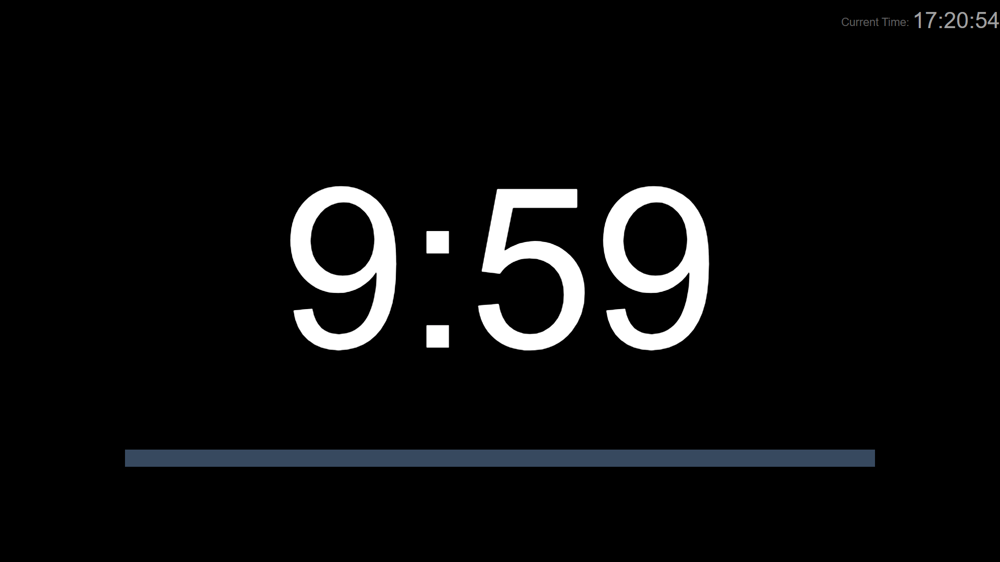

Activating Single Display Mode
===

*First, close any timer browser windows that might be open.*

Click <a href="http://localhost:8088" target="_blank" rel="noopener">here </a> to open the timer controller screen, which you can reposition to the display you intend to use as the stage display:

once you're happy the browser is on the display you wish to use, press the [ S ] key to activate it as a full screen stage display:

Activating Overlay Mode